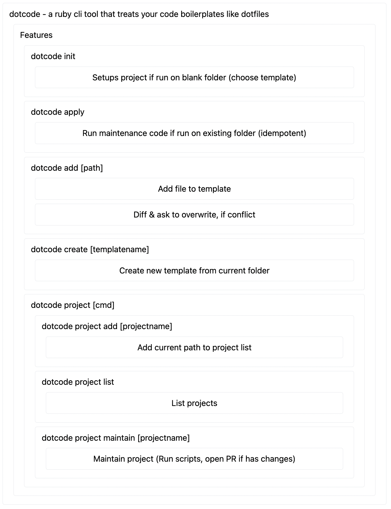

----
title: "Dotcode"
---

```yaml
name: dotcode - a ruby cli tool that treats your code boilerplates like dotfiles
children:
    - name: Features
      children: 
      - n: dotcode init
        c:
        - Setups project if run on blank folder (choose template)
      - n: dotcode apply
        c: 
        - Run maintenance code if run on existing folder (idempotent)
      - n: dotcode add [path]
        c:
        - Add file to template
        - Diff & ask to overwrite, if conflict
      - n: dotcode create [templatename]
        c: 
        - Create new template from current folder
      - n: dotcode project [cmd]
        c: 
        - n: dotcode project add [projectname]
          c: Add current path to project list
        - n: dotcode project list
          c: List projects
        - n: dotcode project maintain [projectname] 
          c: Maintain project (Run scripts, open PR if has changes)
```



## Todos
- [ ] dotcode create (name)
- [ ] dotcode add