# Review and check your Statuses

## About this file

This file was created by the Obsidian Tasks plugin (version 6.0.0) to help visualise the task statuses in this vault.

If you change the Tasks status settings, you can get an updated report by:

- Going to `Settings` -> `Tasks`.
- Clicking on `Review and check your Statuses`.

You can delete this file any time.

## Status Settings

<!--
Switch to Live Preview or Reading Mode to see the table.
If there are any Markdown formatting characters in status names, such as '*' or '_',
Obsidian may only render the table correctly in Reading Mode.
-->

These are the status values in the Core and Custom statuses sections.

| Status Symbol | Next Status Symbol | Status Name | Status Type | Problems (if any) |
| ----- | ----- | ----- | ----- | ----- |
| `space` | `x` | Todo | `TODO` |  |
| `x` | `space` | Done | `DONE` |  |
| `/` | `x` | In Progress | `IN_PROGRESS` |  |
| `-` | `space` | Cancelled | `CANCELLED` |  |
| `space` | `x` | Unchecked | `TODO` | Duplicate symbol '`space`': this status will be ignored. |
| `x` | `space` | Regular | `DONE` | Duplicate symbol '`x`': this status will be ignored. |
| `X` | `space` | Checked | `DONE` |  |
| `-` | `space` | Dropped | `CANCELLED` | Duplicate symbol '`-`': this status will be ignored. |
| `>` | `x` | Forward | `TODO` |  |
| `D` | `x` | Date | `TODO` |  |
| `?` | `x` | Question | `TODO` |  |
| `/` | `x` | Half Done | `IN_PROGRESS` | Duplicate symbol '`/`': this status will be ignored. |
| `+` | `x` | Add | `TODO` |  |
| `R` | `x` | Research | `TODO` |  |
| `!` | `x` | Important | `TODO` |  |
| `i` | `x` | Idea | `TODO` |  |
| `B` | `x` | Brainstorm | `TODO` |  |
| `P` | `x` | Pro | `TODO` |  |
| `C` | `x` | Con | `TODO` |  |
| `Q` | `x` | Quote | `TODO` |  |
| `N` | `x` | Note | `TODO` |  |
| `b` | `x` | Bookmark | `TODO` |  |
| `I` | `x` | Information | `TODO` |  |
| `p` | `x` | Paraphrase | `TODO` |  |
| `L` | `x` | Location | `TODO` |  |
| `E` | `x` | Example | `TODO` |  |
| `A` | `x` | Answer | `TODO` |  |
| `r` | `x` | Reward | `TODO` |  |
| `c` | `x` | Choice | `TODO` |  |
| `d` | `x` | Doing | `IN_PROGRESS` |  |
| `T` | `x` | Time | `TODO` |  |
| `@` | `x` | Character / Person | `TODO` |  |
| `t` | `x` | Talk | `TODO` |  |
| `O` | `x` | Outline / Plot | `TODO` |  |
| `~` | `x` | Conflict | `TODO` |  |
| `W` | `x` | World | `TODO` |  |
| `f` | `x` | Clue / Find | `TODO` |  |
| `F` | `x` | Foreshadow | `TODO` |  |
| `H` | `x` | Favorite / Health | `TODO` |  |
| `&` | `x` | Symbolism | `TODO` |  |
| `s` | `x` | Secret | `TODO` |  |

## Loaded Settings

<!-- Switch to Live Preview or Reading Mode to see the diagram. -->

These are the settings actually used by Tasks.

```mermaid
flowchart LR

classDef TODO        stroke:#f33,stroke-width:3px;
classDef DONE        stroke:#0c0,stroke-width:3px;
classDef IN_PROGRESS stroke:#fa0,stroke-width:3px;
classDef CANCELLED   stroke:#ddd,stroke-width:3px;
classDef NON_TASK    stroke:#99e,stroke-width:3px;

1["'Todo'<br>[ ] -> [x]<br>(TODO)"]:::TODO
2["'Done'<br>[x] -> [ ]<br>(DONE)"]:::DONE
3["'In Progress'<br>[/] -> [x]<br>(IN_PROGRESS)"]:::IN_PROGRESS
4["'Cancelled'<br>[-] -> [ ]<br>(CANCELLED)"]:::CANCELLED
5["'Checked'<br>[X] -> [ ]<br>(DONE)"]:::DONE
6["'Forward'<br>[&gt;] -> [x]<br>(TODO)"]:::TODO
7["'Date'<br>[D] -> [x]<br>(TODO)"]:::TODO
8["'Question'<br>[?] -> [x]<br>(TODO)"]:::TODO
9["'Add'<br>[+] -> [x]<br>(TODO)"]:::TODO
10["'Research'<br>[R] -> [x]<br>(TODO)"]:::TODO
11["'Important'<br>[!] -> [x]<br>(TODO)"]:::TODO
12["'Idea'<br>[i] -> [x]<br>(TODO)"]:::TODO
13["'Brainstorm'<br>[B] -> [x]<br>(TODO)"]:::TODO
14["'Pro'<br>[P] -> [x]<br>(TODO)"]:::TODO
15["'Con'<br>[C] -> [x]<br>(TODO)"]:::TODO
16["'Quote'<br>[Q] -> [x]<br>(TODO)"]:::TODO
17["'Note'<br>[N] -> [x]<br>(TODO)"]:::TODO
18["'Bookmark'<br>[b] -> [x]<br>(TODO)"]:::TODO
19["'Information'<br>[I] -> [x]<br>(TODO)"]:::TODO
20["'Paraphrase'<br>[p] -> [x]<br>(TODO)"]:::TODO
21["'Location'<br>[L] -> [x]<br>(TODO)"]:::TODO
22["'Example'<br>[E] -> [x]<br>(TODO)"]:::TODO
23["'Answer'<br>[A] -> [x]<br>(TODO)"]:::TODO
24["'Reward'<br>[r] -> [x]<br>(TODO)"]:::TODO
25["'Choice'<br>[c] -> [x]<br>(TODO)"]:::TODO
26["'Doing'<br>[d] -> [x]<br>(IN_PROGRESS)"]:::IN_PROGRESS
27["'Time'<br>[T] -> [x]<br>(TODO)"]:::TODO
28["'Character / Person'<br>[@] -> [x]<br>(TODO)"]:::TODO
29["'Talk'<br>[t] -> [x]<br>(TODO)"]:::TODO
30["'Outline / Plot'<br>[O] -> [x]<br>(TODO)"]:::TODO
31["'Conflict'<br>[~] -> [x]<br>(TODO)"]:::TODO
32["'World'<br>[W] -> [x]<br>(TODO)"]:::TODO
33["'Clue / Find'<br>[f] -> [x]<br>(TODO)"]:::TODO
34["'Foreshadow'<br>[F] -> [x]<br>(TODO)"]:::TODO
35["'Favorite / Health'<br>[H] -> [x]<br>(TODO)"]:::TODO
36["'Symbolism'<br>[&amp;] -> [x]<br>(TODO)"]:::TODO
37["'Secret'<br>[s] -> [x]<br>(TODO)"]:::TODO
1 --> 2
2 --> 1
3 --> 2
4 --> 1
5 --> 1
6 --> 2
7 --> 2
8 --> 2
9 --> 2
10 --> 2
11 --> 2
12 --> 2
13 --> 2
14 --> 2
15 --> 2
16 --> 2
17 --> 2
18 --> 2
19 --> 2
20 --> 2
21 --> 2
22 --> 2
23 --> 2
24 --> 2
25 --> 2
26 --> 2
27 --> 2
28 --> 2
29 --> 2
30 --> 2
31 --> 2
32 --> 2
33 --> 2
34 --> 2
35 --> 2
36 --> 2
37 --> 2

linkStyle default stroke:gray
```

